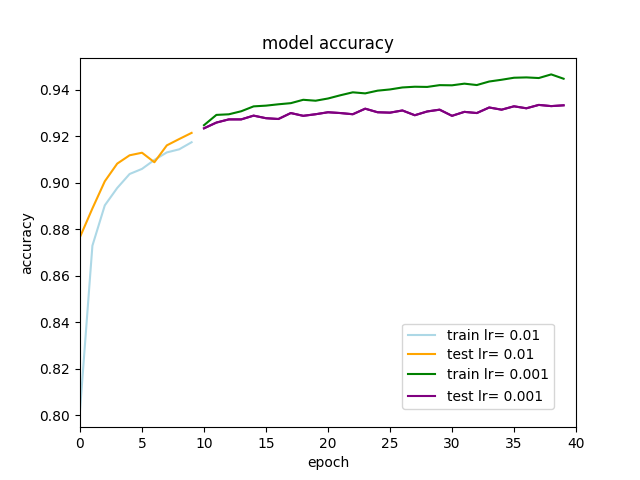
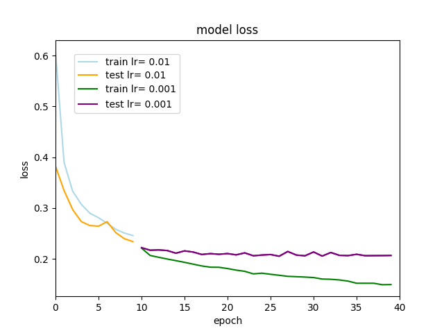

# Read Me

Under this repository files for the models trained for the Fashion-MNIST dataset can be found. Moreover, this Read Me file documents all the steps followed during the experiments as well as the results and the conclusions drawn.

## Instructions
In this repository the following files can be found:

* A .py file : ```train_model.py``` that trains the available models.
* A .py file: ```models.py ``` with the definitions of all the models.
* A .yaml ```model.yaml``` with the model that achieved the highest accuracy.
* A .h5 ```model_weights.h5``` with the weights of the model that achieved the highest accuracy.
* A .py file: ``demo.py`` with the code for detecting objects in a video and classifying them using the model that achieved the highest accuracy.
* A .py file: ``selectivesearch.py`` with a python implementation of selective search algorithm.


To run the first part of the code select one of the five possible models available and run the following instruction on the terminal:

	python train_model.py --model 'model_name'

The possible model names are:

* CNN2
* CNN2_dropout
* CNN3_dropout
* reduced _all _cnn
* model5
	
To run the second part of the code:

	python demo.py
	
## Introduction

The goal of this repository is to test different models on the Fashion-MNIST dataset. Fashion-MNIST is a dataset created by Zalando which consists of a training set of 60,000 examples and a test set of 10,000 examples. Each example is a 28x28 grayscale image, associated with a label from 10 classes. Zalando intended for Fashion-MNIST to serve as a replacement for the original MNIST dataset for benchmarking machine learning algorithms.

## Research

Before starting the deployment of models it is important to establish the benchmark for algorithms trained on Fashion-MNIST. By taking a look at Fashion-MNIST repository on GitHub [[1](https://github.com/zalandoresearch/fashion-mnist)] the specifications along with the accuracy for some models trained on this dataset can be observed. The average accuracy of the models depicted in the repository seems to be around 95%. Even though the most complex models with a high amount of parameters tend to have higher accuracy, some of the smaller models also achieve very good results.

Deep learning networks are known for being computationally very expensive. As the resources for training the models are limited, an adequate balance between complexity and accuracy is searched. Therefore, deep networks with very high amounts of parameters are discarded and more efficient ones are looked into. 

After researching the state of the art, several network structures seems to have the potential of fulfilling the requirements needed. First of all, ShuffleNet-v2 [[2](https://arxiv.org/abs/1807.11164)] is a network designed for mobile devices. This architecture stands out as it is claimed to reduce computation cost while maintaining accuracy. Secondly, LruNet is an architecture with a low amount of parameters. In [[3](https://arxiv.org/pdf/1901.09615.pdf)] LruNet is compared to ShuffleNet-v2 amongst other architectures. Results show that both of them perform very well on this dataset. Moreover, a very simple model with two convolutional layers, batch normalization and skip residual connections is described in [[4](https://ieeexplore.ieee.org/abstract/document/8313740)]. This architecture is claimed to obtain good accuracy with a low amount of parameters. Finally, All-CNN [[5](https://arxiv.org/pdf/1412.6806.pdf)] has been explored as it has a very simple architecture and manages to achieve high prediction rates for image classification tasks.


## Methodology


The results documented in this file have been obtained running the code available this repository on a CPU MacBook Pro Intel 2GHz Core i5. Moreover, Tensorflow with Keras has been used for implementing deep learning models.


### Models tested

Both LruNet and ShuffleNet-v2 had a reduced number of parameters,  200k and 350k respectively. However, they were quickly discarded after trying to train them on Fashion-MNIST for a few epochs. The computational cost was fairly high and the training curve for both of them indicated that many epochs would have been necessary to obtain a good prediction rate. These conclusions are in line with the experiments performed in [[3](https://arxiv.org/pdf/1901.09615.pdf)]. The results depicted in this paper are achieved after training these architectures for 250 epochs.

### Model 1: CNN2 + Batch Normalization + Skip connections

This architecture is described in [[4](https://ieeexplore.ieee.org/abstract/document/8313740)] and can be found in [[6](https://github.com/deepanwayx/fashion-article-classification)]. It has two convolutional layers and uses batch normalization and residual skip connections as ways of improving the performance of the network. 

At the beggining of the network the input layer is found. Inmediatly after that, a combination of layers is repeated twice. This combination is the following:

	x_bn = BatchNormalization (x)
	x_c = Conv2D (x)
	x_add = x_bn + x_c
	x_maxc = MaxPooling2D (x_add)
	
The filters for the convolutional layer are 32x32. As it can be seen in the code above, the output of the BatchNormalization layer is added to the ouput of the Convolutional layer. This sum is then passed to the MaxPooling layer.

The layers that follow are BatchNormalization, Flatten, Dense with 128 units, Dropout of 0.5 and Dense with units = number of classes (10).

The architecture described can be seen below:

	def CNN2(num_classes):
    	input_image = Input(shape=(28, 28, 1))

	    ## first layer
	
	    x1_batch = BatchNormalization()(input_image)
	    x1_conv = Conv2D(32, (3, 3), activation='relu', bias_initializer='RandomNormal', kernel_initializer='random_uniform',
	                     padding = 'same')(x1_batch)
	
	    x1_add = add([x1_batch, x1_conv])
	    x1_pool = MaxPooling2D(pool_size=(2, 2), padding = 'same')(x1_add)
	
	
	    ## second layer
	
	    x2_batch = BatchNormalization()(x1_pool)
	    x2_conv = Conv2D(32, (3, 3), activation='relu', bias_initializer='RandomNormal', kernel_initializer='random_uniform',
	                     padding = 'same')(x2_batch)
	
	    x2_add = add([x2_batch, x2_conv])
	    x2_pool = MaxPooling2D(pool_size=(2, 2), padding = 'same')(x2_add)
	
	
	    ## ouput layer
	
	    x3_batch = BatchNormalization()(x2_pool)
	
	    x = Flatten()(x3_batch)
	    x = Dense(128, activation='relu')(x)
	    x = Dropout(0.5)(x)
	    preds = Dense(num_classes, activation='softmax')(x)
	
	    model = Model(input_image, preds)
		model.compile(loss='categorical_crossentropy',optimizer='adam',metrics=['accuracy'])
    	return model

This model has been trained as described in the paper. Using a batch size of 256 and a adam optimizer with the default learning rate, 0.001, for 35 epochs.

### Model 2: CNN2 + Batch Normalization + Skip connections + Added Dropout

After training the first architecture, a modification of it has been proposed. For this model, two modifications have been made to the original architecture described in [[4](https://ieeexplore.ieee.org/abstract/document/8313740)]. In the first place, the convolutional filters have been changed from 32x32 to 64x64. Also, more Dropout has been added. Dropout of 0.3 has been added immediately after the second convolutional layer. Moreover, the Dropout found by the end of the network has been increased from 0.5 to 0.7.
More information regarding the addition of Dropout can be found in the results section.

The final architecture is the following:

	def CNN2_dropout(num_classes):
    	input_image = Input(shape=(28, 28, 1))

	    ## first layer
	
	    x1_batch = BatchNormalization()(input_image)
	    x1_conv = Conv2D(64, (3, 3), activation='relu', bias_initializer='RandomNormal', kernel_initializer='random_uniform',
	                     padding = 'same')(x1_batch)
	
	    x1_add = add([x1_batch, x1_conv])
	    x1_pool = MaxPooling2D(pool_size=(2, 2), padding = 'same')(x1_add)
	
	
	    ## second layer
	
	    x2_batch = BatchNormalization()(x1_pool)
	    x2_conv = Conv2D(64, (3, 3), activation='relu', bias_initializer='RandomNormal', kernel_initializer='random_uniform',
	                     padding = 'same')(x2_batch)
	    x2_dp = Dropout(0.3) (x2_conv)
	    x2_add = add([x2_batch, x2_dp])
	    x2_pool = MaxPooling2D(pool_size=(2, 2), padding = 'same')(x2_add)
	    
	
	    ## ouput layer
	
	    x3_batch = BatchNormalization()(x2_pool)
	
	    x = Flatten()(x3_batch)
	    x = Dense(128, activation='relu')(x)
	    x = Dropout(0.7)(x)
	    preds = Dense(num_classes, activation='softmax')(x)
	
	    model = Model(input_image, preds)
	    
	    model.compile(loss='categorical_crossentropy',optimizer='adam',metrics=['accuracy'])
    	return model

This model has been trained for 50 epochs using a batch size of 256 and optimizer adam with a default learning rate of 0.001.


### Model 3: CNN3 + Batch Normalization + Skip connections + Added Dropout

A second modification of the first architecture described has been proposed. In this modification, the combination of layers mentioned during the description of the first model has been repeated a third time. Dropout of 0.3 has been added after the second and the third convolutional layers. Also, the Dropout found by the end of the network remains as in Model 2, 0.7.

By adding another convolutional layer, the depth of the network increases and better prediction rate is expected. However, increasing depth also means adding computational time. This is further discussed in the results section.


The final architecture is the following:

	def CNN3_dropout(num_classes):
    	input_image = Input(shape=(28, 28, 1))

	    ## first layer
	
	    x1_batch = BatchNormalization()(input_image)
	    x1_conv = Conv2D(64, (3, 3), activation='relu', bias_initializer='RandomNormal', kernel_initializer='random_uniform',
	                     padding = 'same')(x1_batch)
	
	    x1_add = add([x1_batch, x1_conv])
	    x1_pool = MaxPooling2D(pool_size=(2, 2), padding = 'same')(x1_add)
	
	
	    ## second layer
	
	    x2_batch = BatchNormalization()(x1_pool)
	    x2_conv = Conv2D(64, (3, 3), activation='relu', bias_initializer='RandomNormal', kernel_initializer='random_uniform',
	                     padding = 'same')(x2_batch)
	    x2_dp = Dropout(0.3) (x2_conv)
	    x2_add = add([x2_batch, x2_dp])
	    x2_pool = MaxPooling2D(pool_size=(2, 2), padding = 'same')(x2_add)
	    
	    
	    ## third layer
	
	    x3_batch = BatchNormalization()(x2_pool)
	    x3_conv = Conv2D(64, (3, 3), activation='relu', bias_initializer='RandomNormal', kernel_initializer='random_uniform', padding = 'same')(x3_batch)
	    x3_dp = Dropout(0.3) (x3_conv)
	    x3_add = add([x3_batch, x3_dp])
	    x3_pool = MaxPooling2D(pool_size=(2, 2), padding = 'same')(x3_add)
	
	
	    ## ouput layer
	
	    x4_batch = BatchNormalization()(x3_pool)
	
	    x = Flatten()(x4_batch)
	    x = Dense(128, activation='relu')(x)
	    x = Dropout(0.7)(x)
	    preds = Dense(num_classes, activation='softmax')(x)
	
	    model = Model(input_image, preds)

    	model.compile(loss='categorical_crossentropy',optimizer='adam',metrics=['accuracy'])
    	return model

This model has been trained for 50 epochs on a batch size of 64 and optimizer adam with the default leraning rate of 0.001.

### Model 4: Reduced All-CNN

All-CNN is a network solely based on convolutional layers. All-CNN is reported to achieve good results with a very simple structure.

The original architecture consists on 9 convolutional layers with filters of 96x96 and 192x192 and can be found at [[7](https://github.com/PAN001/All-CNN)]. The high amount of convolutional layers and filters results on over 1 million trainable parameters. In order to build a more efficient model, a reduction in the number of filters has been introduced. Otherwise, the architecture has remained the same.

The model porposed can be seen below:

	def reduced_all_cnn():
	    model = Sequential()
	
	    model.add(Conv2D(32, (3, 3), padding = 'same', activation='relu', input_shape=(28, 28, 1)))
	    model.add(Conv2D(32, (2, 2), padding='same', activation='relu'))
	    model.add(Conv2D(32, (1, 1), padding='same', strides = (2,2)))
	    model.add(Dropout(0.5))
	
	    model.add(Conv2D(64, (3, 3), padding='same', activation='relu'))
	    model.add(Conv2D(64, (3, 3), padding='same', activation='relu'))
	    model.add(Conv2D(64, (3, 3), padding='same', strides = (2,2)))
	    model.add(Dropout(0.5))
	
	    model.add(Conv2D(64, (3, 3), padding = 'same', activation='relu'))
	    model.add(Conv2D(64, (1, 1), padding='valid', activation='relu'))
	    model.add(Conv2D(10, (1, 1), padding='valid'))
	    model.add(BatchNormalization())
	
	    model.add(GlobalAveragePooling2D())
	    model.add(Activation('softmax'))
	    sgd = SGD(lr=0.01, decay=1e-6, momentum=0.9, nesterov=True)
	    model.compile(loss='categorical_crossentropy', optimizer=sgd, metrics=['accuracy'])
	    model.summary()
	    return model

This model has been trained on a batch size of 64 and the optimizer used is stochastic gradient descent with a leraning rate of 0.001.


### Model 5: 3 Conv + BatchNormalization + Dropout

The last model proposed consists on 3 convolutional layers. Different combinations of batch normalization and dropout have been tested until the best performance has been achieved.

The proposed architecture is the following:

	def model5(num_classes):
    	    model = Sequential()
    	    model.add(Conv2D(32, kernel_size = (3,3), activation = 'relu', input_shape = (28,28, 1)))
    	    model.add(BatchNormalization(axis=1))

	    model.add(Conv2D(64, kernel_size = (3,3), activation = 'relu'))
	    model.add(MaxPooling2D(pool_size=(2, 2)))
	    model.add(Dropout(0.2))
	
	    model.add(Conv2D(64, kernel_size = (3,3), activation = 'relu'))
	    model.add(BatchNormalization(axis=1))
	    
	    model.add(Dense(128, activation = 'softmax'))
	    model.add(Dropout(0.7))
	    model.add(Flatten())
	    model.add(Dense(num_classes, activation = 'softmax'))
	    model.compile(loss ='categorical_crossentropy', optimizer =  'adam', metrics =['accuracy'])
	    return model

This model has been trained for 10 epochs with a learning rate of 0.01 and a batch size of 256. Then, trained for another 30 epochs with a learning reate of 0.001 and a batch size of 1024. Having a higher learning rate at the begining accelerates the learning process. However, mantaining a high rate after a few epochs could be detrimental for the network as it can cause the loss function to diverge and scale up. Moreover, the optimizer used in this model is adam.


## Results

### Model 1: CNN2 + Batch Normalization + Skip connections

In [[4](https://arxiv.org/pdf/1901.09615.pdf)] the model implemented is studied in Fashion-MINST dataset. In this study, the highest accuracy reported for the network is of 92.54%. However, after trying to repeat the results the prediction rate was of 92.02%. The difference with the accuracy reported is very small and can be due to the initialization of the weights at the beginning of the training. 

The model was trained for 35 epochs and the training time for this model was of 16.57 minutes. The plots for both the accuracy and the loss function can be seen below. As it can be observed, the accuracy on the test set does not improve much more after epoch 17th. Also, around that same epoch the loss function for the test set starts to increase. On the other hand, the accuracy and the loss function for the training set and the test set keep steadily increasing and decreasing respectively. This an indication the model can be overfitting.


### Model 2: CNN2 + Batch Normalization + Skip connections + Added Dropout 

As it has been previously seen, Model 1 results is overfitting after training for a few epochs. To alleviate this issue, this model is proposed. As described in the methodology section, Model 2 adds more dropout to the architecture. It also increases the number of filters from 32x32 to 64x64 in the convolutional layers.

This model was trained for 50 epochs achieving a final accuracy of 92.37% and a training time of 50.37 minutes. The plots for both the accuracy and the loss function can be seen below. As it can be observed, the accuracy of both the training and test set increases steadily. The loss function for the training set keeps decreasing but decreases very slowly in the test set after epoch 30.

Prediction rate does not improve much when comparing it to Model 1. However, the plots indicate that the accuracy reached is not the highest the model can reach. 


### Model 3: CNN3 + Batch Normalization + Skip connections + Added Dropout

As described in the Methodology, Model 3 is a modification of Model 2. In this network, a third convolutional layer has been added. 

This model was trained for 50 epochs achieving a final accuracy of 92.75% and a training time of 57.28 minutes. Even though this model is deeper than Model 2 there is not much difference in the training time. The best performance was achieved using a batch size of 64.

The plots for both the accuracy and the loss function can be seen below. As it can be observed, the accuracy of both the training and test keeps increasing. The loss function for the training set decreases steadily but the test set has a slower descent after epoch 35. Model 3 is also bumpier than Model 2. Most likely due to the smaller batch size.


### Model 4: Reduced All-CNN

In the first place, the original All-CNN found in [[7](https://github.com/PAN001/All-CNN)] was trained on the dataset. The accuracy achieved was 92.36% but the training time was over 6 hours. The network had to be modified for it to be efficient for the proposed task. As explained in the methodology section, the computational complexity was decreased by reducing the number of filters. After the modification, the network went to having over 1 million training parameters to less than 140 thousand. The accuracy achieved was 92.53% with a training time of 62.78 minutes.

Below, plots for both All-CNN and reduced All-CNN can be seen (first pair and second pair respectively). As it can be observed in the first pair of images, the accuracy for the test set in All-CNN increases very slowly after epoch 25. At the same time, the loss function of the test set for All-CNN becomes stagnant around the same epoch. In the second pair of images, it can be seen that the accuracy for the reduced model keeps increasing in both the test and training set. In the same way, the loss function of both the test and the training set keeps decreasing steadily.


### Model 5: 3 Conv + BatchNormalization + Dropout

The last model implemented is the one with highest prediction rate. This model achieved a 93.24% accuracy. It was trained for 40 epochs that took around 100 minutes. 

A higher accuracy was achived by decreasing the learning rate from 0.01 to 0.001 after the first 10 epochs. In the images below the accuracy and the loss for both the training and test set can be observed. The accuracy of the training set increases very slowly after epoch 20. In the same way, the loss function 
remains constant after that epoch.






### Performance Analysis

In the table below ,a comparison between the models can be found. As some models have been trained for more epochs than others, the time/epoch has been calculated and included in this table.

Model         | Nº parameters  | Time (min) |  Time (s) /epoch    | Accuracy  |
-----------------|--------------|------------| ------|  ------|
CNN2 + BatchNorm + Skip |  211,950   |  **16.57**  |    **28.07**             | 92.04% | 
CNN2 + BatchNorm + Skip + Dropout| 440,910 | 50.37 | 60.44 | 92.37% | 
CNN3 + BatchNorm + Skip + Dropout  | 207,758  | 57.28  |  68.74  | 92.75% |
All-CNN | 1,248,202  | 374.76 |  562.14   | 92.36% |
reduced All-CNN |   139,634  | 62.78  |  94.17   | 92.54%|
3 layer CNN  | 192,218  | 100.63  | 150.95 |  **93.24%** |

## Classifying objects in video
This section is dedicated to the demo program implemented. The program detects objects in video files and classifies them using the model that achieved the highest prediction rate on the Fashion-MNIST dataset, Model 5.

First, the program records a video for a specified amount of frames. Then, selective search algorithm is applied to each one of the frames of the video. The regions proposed by selective search are then cropped and processed. The preprocessed regions are then fed to the model and a prediction is made. If the prediction is above a certain threshold (0.9) a bounding box with the label of the object will be drawn in the original frame. Once all the bounding boxes for the predicted objects have been drawn, the frame is stored in a video file.

One of the most challenging parts of implementing this demo is detecting objects in a frame. Deep neural networks such as YOLO and Faster-CNN can detect and classify objects in real-time or nearly real-time. These architectures use CNNs to obtain region proposals. However, this task is very challenging when applying segmentation algorithms segment the frame and propose regions. In the demo, a python implementation of selective search has been used for region proposal. Selective search produces small candidate regions by performing image segmentation. Then, greedily combines the regions into bigger ones. Unfortunately, selective search is a very slow algorithm and makes impossible real-time object detection. The python implementation of the selective search algorithm can be found at [[8](https://github.com/AlpacaDB/selectivesearch)]. 

Another issue is the dataset used for training the model. The Fashion-MNIST dataset does not depict real-world images as all of the samples have the same background. Moreover, the images used are very small and therefore details can be lost. Predicting real-world images using this kind of dataset is nearly impossible as models can only be as good as the data provided. 

As expected, the results are not good. In the image below a screenshot of one of the videos recorded can be seen.


## Conclusions

During the development of this work, five different networks for classifying Fashion-MNIST dataset have been proposed. 

The most efficient model took around 28s per epoch to be trained. However, the prediction rate for this model was the lowest. When comparing these model to the others, we can observe that the heavy use of batch normalization in the network helps to reduce the training time. Residual skip connections also help to accelerate the process. Moreover, the number of filters used is small. The modified models of this architecture provide a better fit for the data by adding dropout. This is done without increasing too much the computational time, which in these cases is around 65s per epoch. However, not much improvement is seen after increasing the depth of the network.

It has also been observed, that a network can become more efficient by reducing the number of filters. This is observed by comparing the results of All-CNN to the proposed model, reduced All-CNN. The results in the performance analysis section show that the reduced network achieves similar performance to the original one. At the same time, the computational time is reduced by over 80%.

After investigating how these architectures perform, the model that achieved the highest performance was built. The prediction rate for Model 5 is 93.24%. However, the computational time is significantly bigger than for the other models.

Data augmentation was tested but not included as it did not seem to improve the immediate performance of the models. For making a difference, the models should probably have been trained for more epochs when including data augmentation. As the computational time was a constraint this option was dismissed. 

Finally, a demo program for classifying objects in video has been developed. The region proposal is performed by a python implementation of selective search algorithm. This algorithm is slow and makes it impossible for the solution to work in real-time. As pointed out before, the Fashion-MNSIT dataset is not representative of a real-world scenario. The images forming the dataset have plain backgrounds and are very small. Also, real-world objects most likely present cluttered backgrounds and can suffer from occlusions or be close to other objects. Data augmentation could be a way of achieving better results. By applying projective transformations and random erasing [[9](https://arxiv.org/abs/1708.04896)] a dataset more similar to a real-world scenario could be built. Segmenting objects in the regions proposed by selective search could also boost performance as the cluttered background issue could be palliated. However, as the objects that can be found will be very different from each other this task can be overly complex.


## References

**[1]** Zalando, Fashion-MNIST dataset. Available online at: https://github.com/zalandoresearch/fashion-mnist

**[2]** N. Ma, X. Zhang, H.-T. Zheng, and J. Sun. *Shufflenet v2: Practical guidelines for efficient cnn architecture design.* ECCV, 2018.

**[3]** Okan Köpüklü, Maryam Babaee, Gerhard Rigoll, *Convolutional Neural Networks with Layer Reuse*, 2019.

**[4]** S. Bhatnagar, D. Ghosal, M.H. Kolekar. *Classification of fashion article images using convolutional neural networks.*
Proceedings of the international conference on image information processing (2017), pp. 1-6.

**[5]** J. T. Springenberg, A. Dosovitskiy, T. Brox, and M. Ried- miller. *Striving for simplicity: The all convolutional net*, 2014.

**[6]** deepanwayx, Fashion article classification. 2018. Available at: https://github.com/deepanwayx/fashion-article-classification

**[7]** PAN001, All-CNN. 2017. Available online at: https://github.com/PAN001/All-CNN

**[8]** AlpacaDB, Selective Search python implementation. Available online at: https://github.com/AlpacaDB/selectivesearch

**[9]** Z. Zhong, L. Zheng, G. Kang, S. Li, and Y. Yang. *Random Erasing Data Augmentation,*  2017.

